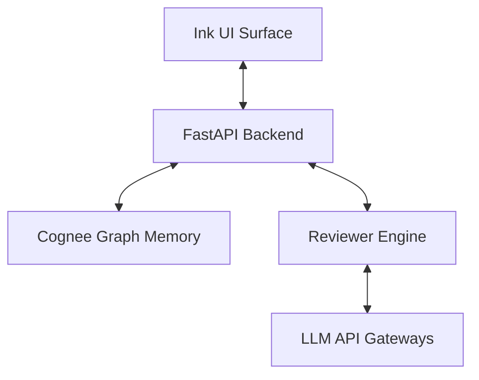
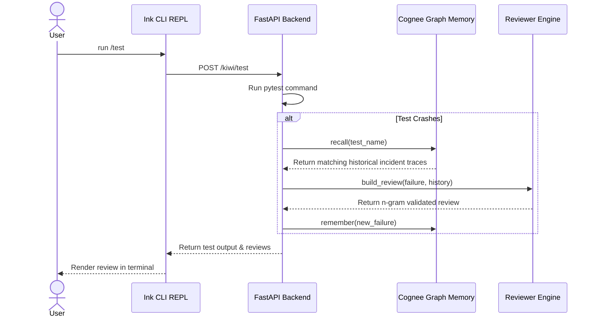
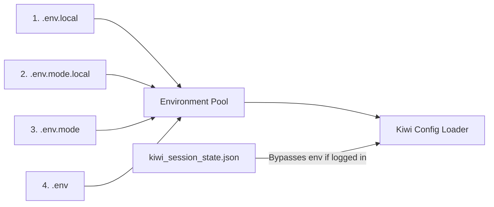

# Kiwi - QA Harness Agent

Kiwi is a terminal-native, intelligent QA assistant designed to integrate graph-based memory retrieval (powered by Cognee) with local test executions (via pytest).

---

## Key Features

* **Terminal-Native REPL**: A reactive CLI surface built with React + Ink, offering autocomplete suggestions and instant command execution.
* **Graph-Based Memory**: Uses Cognee to index incident logs, stack traces, and resolution summaries, dynamically recalling them during test failures.
* **Dynamic Credentials Gate**: Keeps API credentials secure and overrides them step-by-step or automatically using .env priority lookups (.env.local -> .env).
* **Multi-Provider LLM Integration**: Dynamically switches LLM providers (Anthropic, Gemini, OpenAI) and active model configurations at runtime.
* **Factual Reviews**: Generates test reviews grounded in historical failure records, validated via sentence n-gram verification to eliminate hallucinations.

---

## System Architecture

Kiwi uses a layered architecture separating entry surfaces, agent reasoning, memory matching, and subprocess environments.

### Component Architecture



### Turn Execution Sequence Diagram



### Configuration Priority Resolution



1. **Surface Layer**: Built with React and Ink, providing terminal components, state management, and autocomplete command suggestions.
2. **Backend API Layer**: Built with FastAPI, acting as a middleware server coordinating pytest runs, memory writes, and status checks.
3. **Memory Layer**: Built on the Cognee graph database platform to store and query failure logs contextually.
4. **Reviewer Engine**: Runs LLM queries and validates output using sentence n-gram verification against recalled context.

---

## Subsystems

### CLI REPL Subsystem
Located in `kiwi-ui/index.tsx`, this subsystem handles stdin/stdout rendering, command routing, autocomplete dropdowns, welcome menus, and credentials gating.

### API Backend Subsystem
Located in `app/main.py`, this coordinates API requests, runs subprocesses, and manages configurations in `kiwi_session_state.json`.

### Memory Subsystem
Located in `sentinel/cognee_client.py`, this wraps Cognee API commands (`remember` and `recall`) and indexes incident traces into vector databases.

---

## Execution Tools

### Pytest Executable Tool
Invokes pytest in a local subprocess with JUnit XML serialization flags (`--junitxml=junit_report.xml`) and tracks local failure metrics.

### Cognee Storage Client Tool
Performs vector similarity queries (`recall`) and updates graph memory nodes (`remember`).

### Review Builder Tool
Translates JUnit XML outputs and git changes into grounded developer reviews via Dynamic LLM calls.

---

## Commands Registry

| Command | Description |
|---|---|
| `/login` | Starts the step-by-step interactive credentials gate. |
| `/provider` | Allows switching active LLM Provider (Anthropic, OpenAI, Gemini). |
| `/model` | Allows selecting provider-specific models. |
| `/config` | Prints active configuration and settings. |
| `/clear` | Instantly clears the screen's message logs. |
| `/test [path]` | Spawns pytest and auto-ingests failures. |
| `/remember <text>` | Manually saves a custom fact/incident comment to graph memory. |
| `/recall <query>` | Contextually queries the Cognee memory graph. |
| `/resolve <summary>`| Records a resolution/fix summary for the last failing test. |
| `/flaky [test]` | Lists flaky-test failure counts. |
| `/history <test>` | Lists all historical failures of a target test. |
| `/session` | Outputs logs for the active CLI session. |
| `/forget` | Explicitly clears datasets from Cognee memory. |
| `/exit` | Safely quits the Kiwi CLI. |
| `/fix [path]` *(planned)* | Runs a multi-step agentic loop to autonomously diagnose and fix a failing test. |

---

## Roadmap: Agentic QA Harness

Kiwi is moving from a one-shot NL-to-single-action assistant toward a real agentic harness for QA — the same run → inspect → search → edit → rerun loop Claude Code uses for coding tasks, but scoped to diagnosing and fixing failing tests. Autonomous file edits will be gated behind per-action human approval, with a fixed step budget so the loop always terminates with a report. See the full design at [docs/superpowers/specs/2026-07-20-agentic-qa-harness-design.md](docs/superpowers/specs/2026-07-20-agentic-qa-harness-design.md).

---

## Getting Started

### 1. Prerequisites
* Python 3.10+
* Node.js & pnpm
* uv (Fast Python package manager)

### 2. Configuration Setup
Create a `.env.local` or `.env` in the root directory:
```env
COGNEE_BASE_URL=https://<your-tenant>.cognee.ai
COGNEE_API_KEY=<your-api-key>
COGNEE_TENANT_ID=<your-tenant-id>

# LLM Keys
ANTHROPIC_API_KEY=<key>
GEMINI_API_KEY=<key>
OPENAI_API_KEY=<key>
```

### 3. Install Frontend Dependencies
Since the CLI's UI dependencies are located in the `kiwi-ui` directory, install them with:
```bash
pnpm install --prefix kiwi-ui
```
Or navigate into the directory and install:
```bash
cd kiwi-ui
pnpm install
```

### 4. Run the Backend API
```bash
uv run uvicorn app.main:app --port 8000
```

### 5. Run the CLI REPL
Use the silent launcher command for your shell:
* **CMD**: `kiwi`
* **PowerShell**: `.\kiwi`

*(Alternatively, you can launch via `pnpm kiwi`)*

---

## Codebase Documentation

For in-depth developer orientation, refer to:
* [Exploration Guide](docs/exploration_guide.md): Code orientation map and data pipeline flow.
* [Subsystems Guide](docs/subsystems.md): Structural details of CLI, Backend, Memory, and Review engines.
* [Tools Reference](docs/tools.md): Specs for Kiwi's execution modules.
* [Command Reference](docs/commands.md): Details, functions, and examples for all REPL slash commands.
